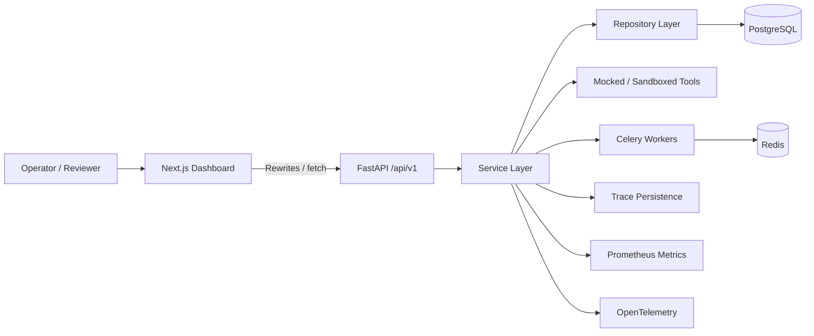

# AI Agent Control Plane

AI Agent Control Plane is a production-style control plane for AI agents. It tracks agent versions, executes runs, gates tool use with policy and human approval, records traces, runs evaluations, controls deployment to production, and now exposes a dashboard for operators and reviewers.

## Project Overview

This repository is a backend-first platform with a frontend dashboard layered on top.

- `backend/` contains the FastAPI service, SQLAlchemy models, Alembic migrations, Celery workers, and the domain services.
- `frontend/` contains the Next.js 15 dashboard that consumes the backend APIs.
- `docs/` contains the architectural and API documentation that future agents can use as project memory.

The system is intentionally operational, not conversational. It is built to answer:

- Which version ran?
- What happened during execution?
- Which tools were invoked?
- Was the action allowed, blocked, or approved?
- Did the version regress?
- Can it be promoted safely?

## Problem Statement

Teams can ship agent logic quickly, but without a control plane they lose visibility and control.

This project solves the operational gap by making agent lifecycle events queryable and auditable:

- versioned registry state,
- runtime execution history,
- policy and approval decisions,
- trace timelines,
- evaluation results and comparisons,
- deployment promotion and rollback history,
- and a dashboard that surfaces all of the above.

## Architecture Overview



## Core Features

- Agent registry with versioned configurations.
- Runtime execution with tool call auditing.
- Safety-gated tool execution and approval workflows.
- Trace-level observability and failure inspection.
- Evaluation harness for suites, reporting, and regression detection.
- Deployment control with promotion gates, rollback, and deployment history.
- Dashboard pages for agents, runs, approvals, evaluations, deployment history, and timeline inspection.

## Engineering Highlights

For recruiters, hiring managers, and engineers, the notable pieces are:

- **Agent versioning**: agent configs are immutable once created, with lifecycle transitions tracked explicitly.
- **Safety-gated tool execution**: every tool call is evaluated before execution and can be blocked or sent for approval.
- **Evaluation harness**: suites run against agent versions and generate comparable aggregate metrics.
- **Trace-level observability**: runs, tools, approvals, evaluations, and deployments are persisted as timelines.
- **Deployment controls**: production promotion is gated by evaluations and rollback is history-aware.
- **Dashboard delivery**: the frontend consumes the real API surface with typed client code and reactive data fetching.

## Technology Stack

Backend:

- Python 3.12+
- FastAPI
- SQLAlchemy 2.0
- Alembic
- PostgreSQL
- Celery
- Redis
- Pydantic v2
- OpenTelemetry
- Prometheus client
- uv
- Pytest

Frontend:

- Next.js 15+
- TypeScript
- React 19
- Tailwind CSS
- shadcn-style UI primitives
- React Query

## Local Development Setup

1. Copy environment files:

   ```bash
   cp .env.example .env
   cp frontend/.env.example frontend/.env.local
   ```

2. Start the backend infrastructure:

   ```bash
   make dev
   ```

3. Build and start the full stack, including the frontend:

   ```bash
   docker compose up --build
   ```

4. Prepare the backend environment:

   ```bash
   cd backend
   uv sync --locked --dev
   uv run alembic upgrade head
   ```

5. If you want to run the dashboard outside Docker:

   ```bash
   cd frontend
   npm install
   npm run dev
   ```

6. Open the dashboard at:

   ```text
   http://localhost:3000
   ```

The dashboard rewrites `/api/*`, `/health`, `/ready`, and `/metrics` to the backend, so browser requests stay simple during local development.

## Quick Demo

The fastest way to see the platform populated is:

```bash
docker compose up --build
python scripts/seed_demo.py
python scripts/demo_check.py
```

Then open:

- http://localhost:3000
- http://localhost:8000/docs

Recommended demo flow:

1. Seed the database and backend metrics with `python scripts/seed_demo.py`.
2. Run `python scripts/demo_check.py` to confirm the backend, database, and metrics endpoint are healthy.
3. Open the dashboard home first to show the operational summary.
4. Move into agents, runs, approvals, evaluations, and deployments to show the full control-plane story.
5. Use the run timeline viewer and failure analysis pages to show trace-level inspection.

## Running Tests

Backend:

```bash
cd backend
uv run pytest
uv run ruff check .
```

Frontend:

```bash
cd frontend
npm run typecheck
npm run build
```

## Database Migrations

Create a backend revision:

```bash
cd backend
uv run alembic revision --autogenerate -m "describe schema change"
```

Apply migrations:

```bash
cd backend
uv run alembic upgrade head
```

Validate against Docker Postgres:

```bash
docker compose run --rm api uv run alembic upgrade head
```

## API Overview

Backend route groups:

- `GET /health`
- `GET /ready`
- `GET /metrics`
- `POST /api/v1/agents`
- `GET /api/v1/agents`
- `GET /api/v1/agents/{agent_id}`
- `POST /api/v1/agents/{agent_id}/versions`
- `GET /api/v1/agents/{agent_id}/versions`
- `PATCH /api/v1/agents/{agent_id}/versions/{version_id}`
- `POST /api/v1/agents/{agent_id}/versions/{version_id}/deprecate`
- `GET /api/v1/agents/{agent_id}/deployments`
- `POST /api/v1/runs`
- `GET /api/v1/runs`
- `GET /api/v1/runs/{run_id}`
- `GET /api/v1/runs/{run_id}/timeline`
- `GET /api/v1/runs/{run_id}/failures`
- `GET /api/v1/traces/{trace_id}`
- `GET /api/v1/approvals`
- `GET /api/v1/approvals/{approval_id}`
- `POST /api/v1/approvals/{approval_id}/approve`
- `POST /api/v1/approvals/{approval_id}/reject`
- `POST /api/v1/evaluations`
- `GET /api/v1/evaluations`
- `GET /api/v1/evaluations/{evaluation_id}`
- `GET /api/v1/evaluations/{evaluation_id}/report`
- `POST /api/v1/evaluations/compare`
- `POST /api/v1/deployments/promote`
- `POST /api/v1/deployments/rollback`

The dashboard consumes these routes directly through a typed API client in `frontend/lib/api/`.

## Dashboard Route Map

- `/` dashboard home
- `/agents` agent registry
- `/agents/[agentId]` agent details
- `/runs` run history
- `/runs/[runId]/timeline` run timeline viewer
- `/approvals` approval queue
- `/evaluations` evaluation history
- `/evaluations/compare` evaluation comparison
- `/deployments` deployment history

## Project Roadmap

Completed backend milestones:

1. Foundation
2. Agent Registry
3. Runtime and Tool Framework
4. Safety Gateway and Approval Queue
5. Trace and Observability APIs
6. Evaluation Harness
7. Deployment Control

Current frontend milestone:

8. Dashboard MVP

Next roadmap items:

9. Backend hardening
10. Terraform / AWS deployment

## Future Improvements

- Persist policy configuration instead of hardcoding defaults.
- Move evaluation suites into a managed catalog if suite operations grow.
- Add stronger auth around approvals and deployment actions.
- Expand runtime into richer multi-step orchestration.
- Replace local-only telemetry export with production collectors and backends.
- Add formal release and operational runbooks.

## Documentation

- [Architecture](docs/architecture.md)
- [System Design](docs/system_design.md)
- [API Reference](docs/api_reference.md)

## Notes

- `uv` is the supported dependency manager for the backend.
- The frontend is a separate Next.js app under `frontend/`.
- Do not add `requirements.txt` unless tooling explicitly requires it.
