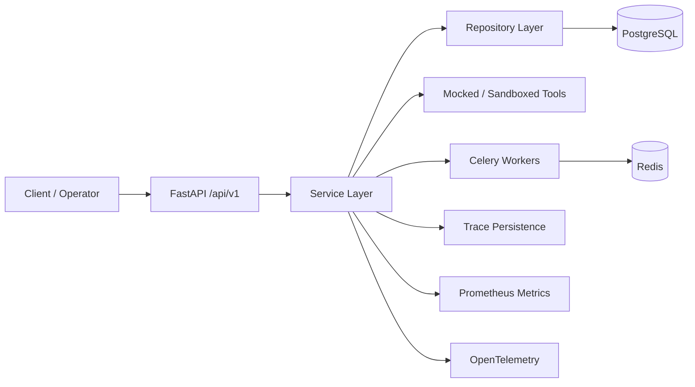
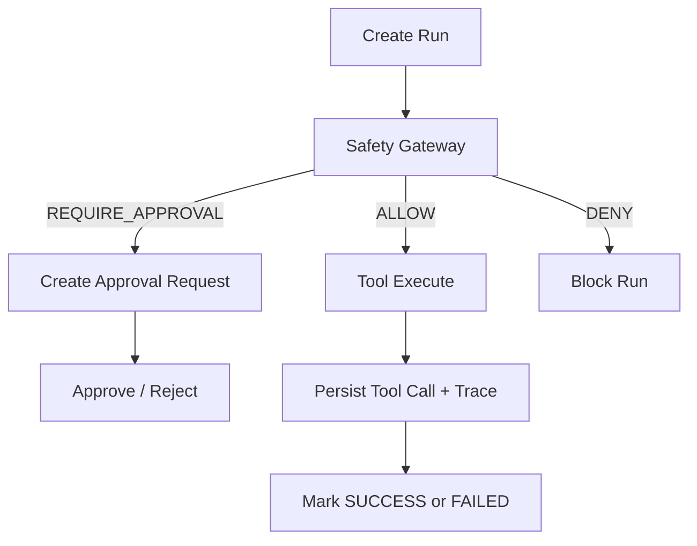
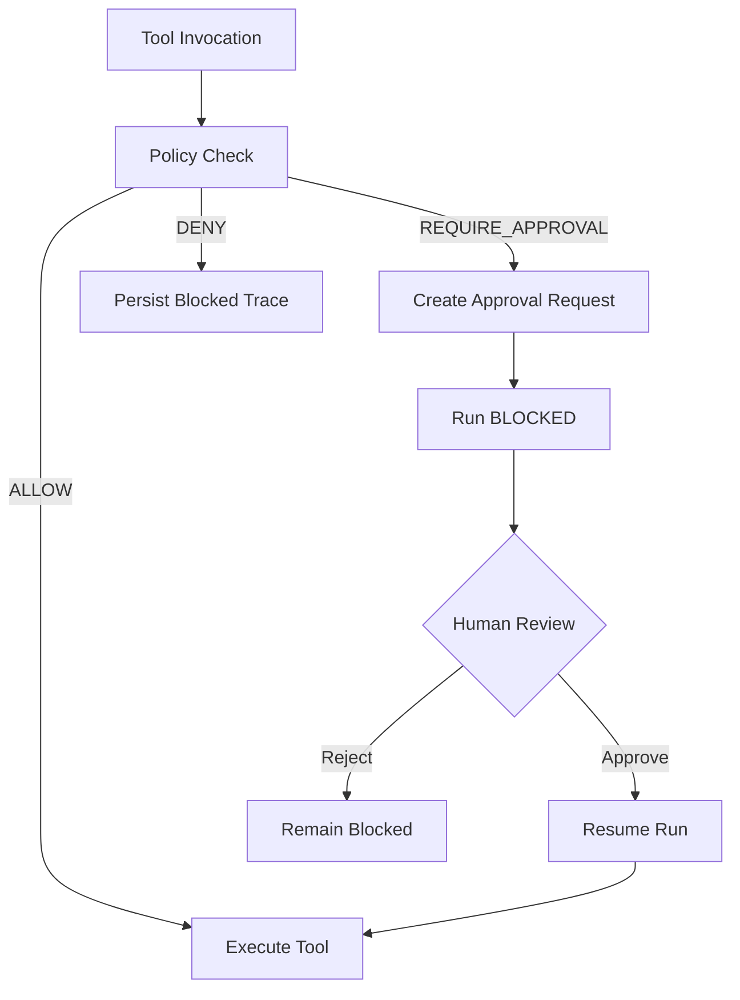
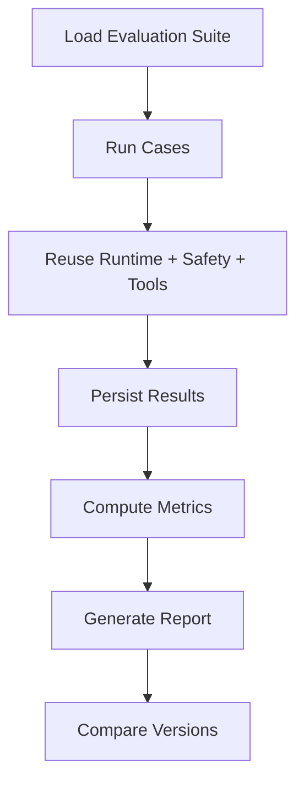
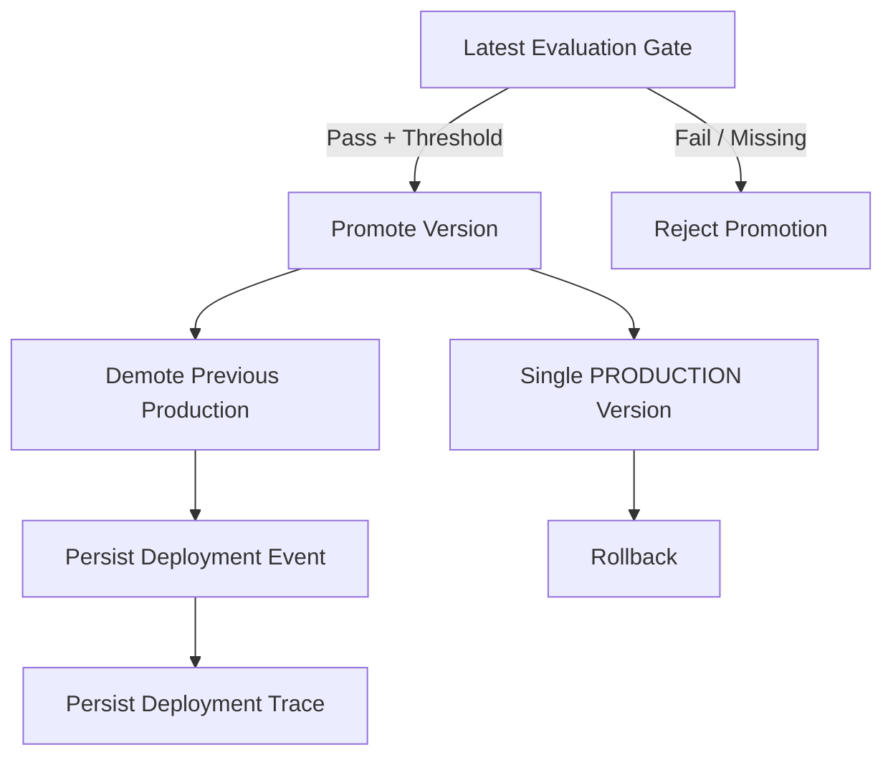

# AI Agent Control Plane

AI Agent Control Plane is a backend-first AgentOps platform for managing agent versions, executing runs, auditing tool use, evaluating behavior, observing failures, and controlling promotion to production.

## Project Overview

This project exists to provide the control layer around AI agents. It is not a chatbot and not a model provider wrapper. The core idea is to make every agent version, runtime action, approval, evaluation, and deployment event queryable and auditable.

## Problem Statement

Teams can ship agent code quickly, but without a control plane they lose visibility into:

- which version ran,
- what tools were used,
- whether policy blocked an action,
- whether a version regressed,
- and whether production promotion was justified.

This repository implements the backend foundation for solving that operational gap.

## Architecture Overview



### Runtime Execution



### Safety Approval Workflow



### Evaluation Workflow



### Deployment Workflow



## Core Features

- Agent registry with versioned configurations.
- Runtime execution with tool call auditing.
- Safety-gated tool execution and human approval workflows.
- Trace-level observability and failure inspection.
- Evaluation harness for suites, reporting, and regression detection.
- Deployment control with promotion gates, rollback, and deployment history.

## Engineering Highlights

For recruiters, hiring managers, and engineers, the key capabilities are:

- **Agent versioning**: every agent has immutable versions with lifecycle control.
- **Safety-gated tool execution**: every tool invocation is policy-checked before execution.
- **Evaluation harness**: suites can be run against agent versions and compared over time.
- **Trace-level observability**: runs, tools, approvals, evaluations, and deployments are persisted as timelines.
- **Deployment controls**: production promotion is gated by evaluation outcomes and rollback is history-aware.

## Technology Stack

- Python 3.12+
- FastAPI
- SQLAlchemy 2.0
- PostgreSQL
- Alembic
- Celery
- Redis
- Pydantic v2
- OpenTelemetry
- Prometheus client
- uv
- Pytest

## Local Development Setup

1. Copy environment configuration:

   ```bash
   cp .env.example .env
   ```

2. Start local services:

   ```bash
   make dev
   ```

3. Sync the backend environment:

   ```bash
   make sync
   ```

4. Run database migrations:

   ```bash
   make migrate
   ```

5. Once `make dev` is running, the API is available at `http://localhost:8000`.

## Running Tests

Run the backend test suite:

```bash
cd backend
uv run pytest
```

Run lint checks:

```bash
cd backend
uv run ruff check .
```

## Database Migrations

Create a revision:

```bash
make revision MSG="describe schema change"
```

Apply migrations:

```bash
make migrate
```

Validate against Docker Postgres:

```bash
docker compose run --rm api uv run alembic upgrade head
```

## API Overview

Public API groups:

- `GET /health`
- `GET /ready`
- `GET /metrics`
- `POST /api/v1/agents`
- `GET /api/v1/agents`
- `GET /api/v1/agents/{agent_id}`
- `POST /api/v1/agents/{agent_id}/versions`
- `GET /api/v1/agents/{agent_id}/versions`
- `PATCH /api/v1/agents/{agent_id}/versions/{version_id}`
- `POST /api/v1/agents/{agent_id}/versions/{version_id}/deprecate`
- `GET /api/v1/agents/{agent_id}/deployments`
- `POST /api/v1/runs`
- `GET /api/v1/runs`
- `GET /api/v1/runs/{run_id}`
- `GET /api/v1/runs/{run_id}/timeline`
- `GET /api/v1/runs/{run_id}/failures`
- `GET /api/v1/traces/{trace_id}`
- `GET /api/v1/approvals`
- `GET /api/v1/approvals/{approval_id}`
- `POST /api/v1/approvals/{approval_id}/approve`
- `POST /api/v1/approvals/{approval_id}/reject`
- `POST /api/v1/evaluations`
- `GET /api/v1/evaluations`
- `GET /api/v1/evaluations/{evaluation_id}`
- `GET /api/v1/evaluations/{evaluation_id}/report`
- `POST /api/v1/evaluations/compare`
- `POST /api/v1/deployments/promote`
- `POST /api/v1/deployments/rollback`

Full request and response examples live in [docs/api_reference.md](docs/api_reference.md).

## Project Roadmap

Completed backend milestones:

1. Foundation
2. Agent Registry
3. Runtime and Tool Framework
4. Safety Gateway and Approval Queue
5. Trace and Observability APIs
6. Evaluation Harness
7. Deployment Control

Next roadmap items:

1. Backend hardening
2. Frontend Dashboard
3. Terraform/AWS

## Future Improvements

- Persist policy configuration instead of hardcoding defaults.
- Move evaluation suites into a managed catalog if suite operations get larger.
- Add stronger auth around approvals and deployment actions.
- Expand runtime into richer multi-step orchestration.
- Replace local-only telemetry export with production collectors and backends.
- Add frontend and infrastructure layers only after the backend contract is stable.

## Documentation

- [Architecture](docs/architecture.md)
- [System Design](docs/system_design.md)
- [API Reference](docs/api_reference.md)

## Notes

- `uv` is the supported dependency manager.
- Do not add `requirements.txt` unless tooling explicitly requires it.
- This repository is intentionally backend-first.
