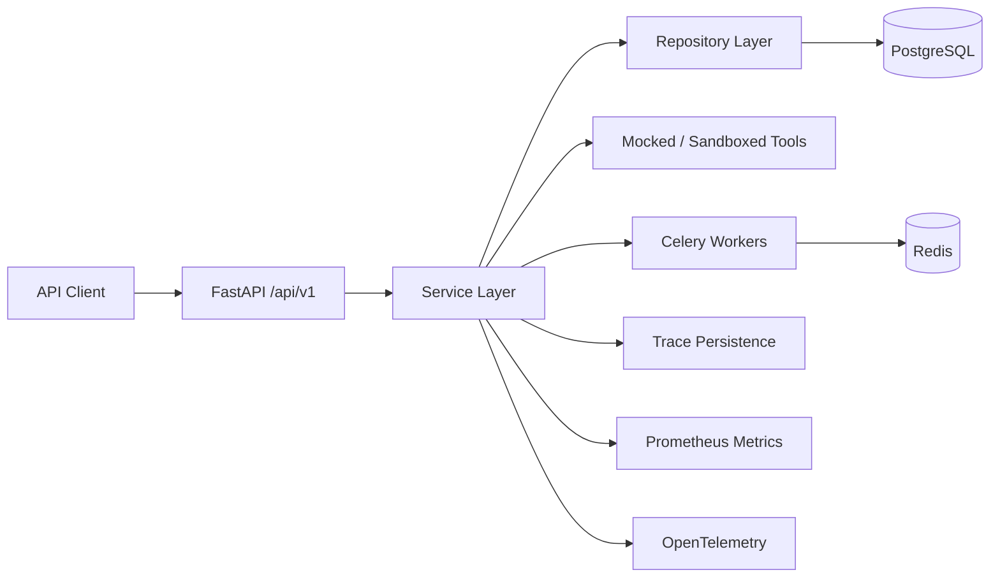
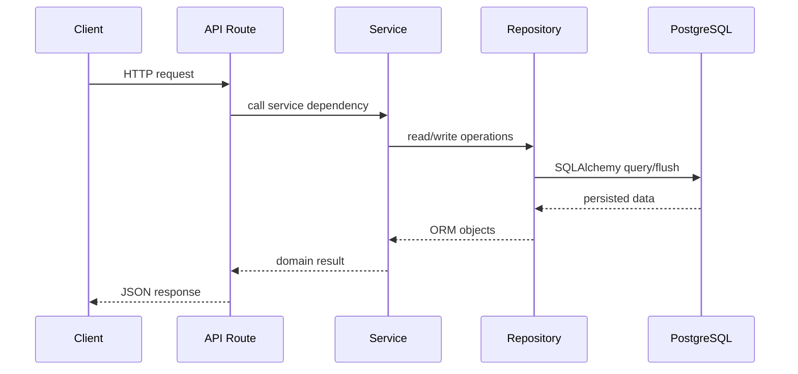
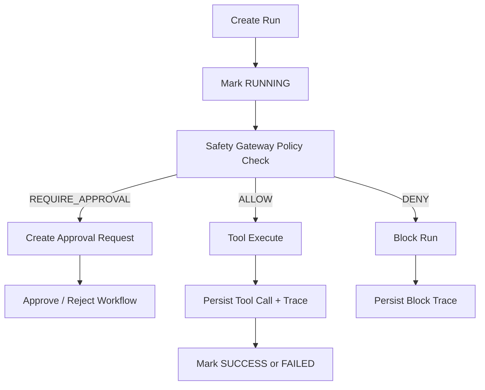
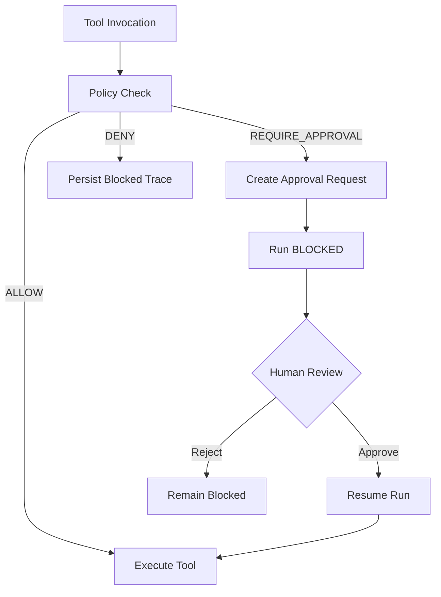
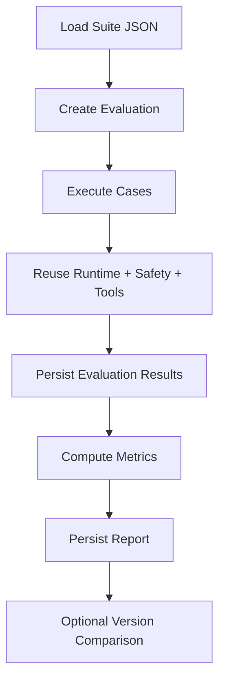
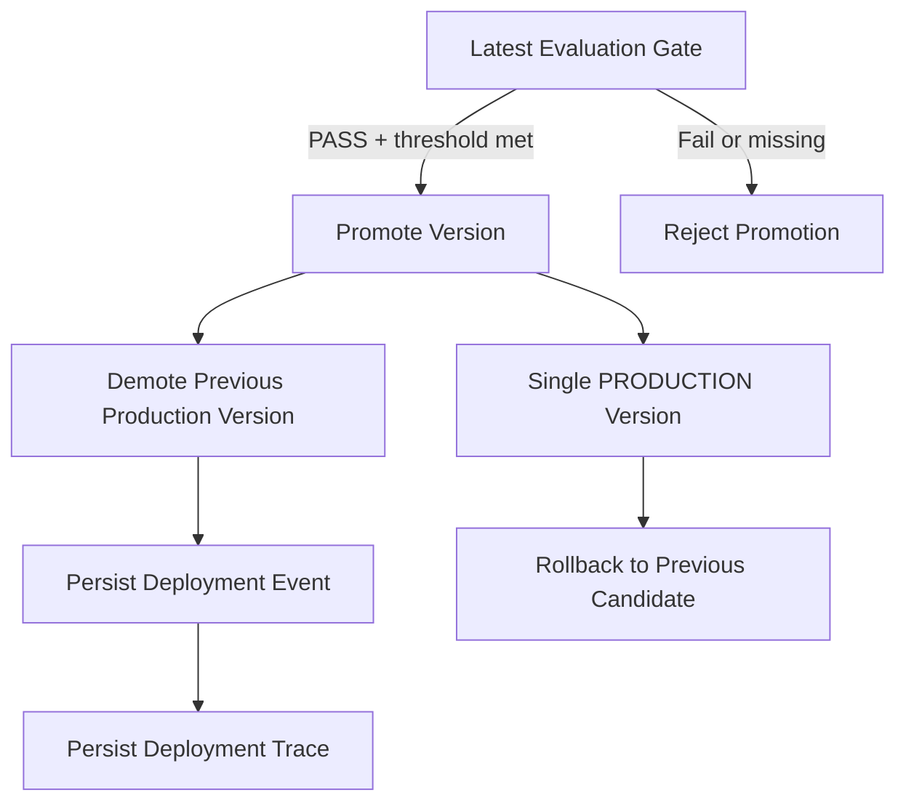
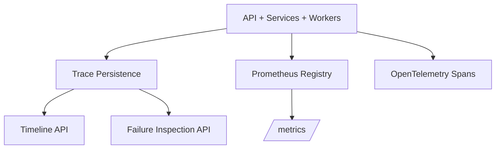

# Architecture

This project is a backend-first AgentOps control plane. It manages agent versions, runtime execution, safety approvals, evaluation runs, observability, and deployment promotion through a clean service-oriented backend.

## High-Level Architecture

## Component Responsibilities

- `app/api`: HTTP routing, request validation, response serialization, dependency injection.
- `app/services`: business rules, orchestration, transaction boundaries, workflow state transitions.
- `app/repositories`: SQLAlchemy persistence only, no business decisions.
- `app/db`: SQLAlchemy base classes, session handling, ORM models.
- `app/tools`: executable tool abstractions and mocks.
- `app/workers`: async execution entry points for Celery.
- `app/core`: configuration, logging, telemetry, metrics.

## Request Flow

## Runtime Flow

## Safety Approval Workflow

## Evaluation Flow

## Deployment Flow

## Observability Flow

## Milestone Coverage

- Agent Registry owns versioned agent configuration.
- Runtime owns run lifecycle and tool call auditing.
- Safety Gateway owns policy-gated execution and approvals.
- Observability owns trace lookup, timeline, failure analysis, and metrics.
- Evaluation Harness owns suite execution, result persistence, and regression comparison.
- Deployment Control owns promotion, rollback, and production assignment.

## Implementation Notes

- API routes are thin and delegate immediately to services.
- Service methods own transaction boundaries and write orchestration.
- Repositories never decide whether an operation is allowed.
- The system persists operational data before exposing it through query APIs.
- Tools remain mocked or sandboxed for MVP safety.
